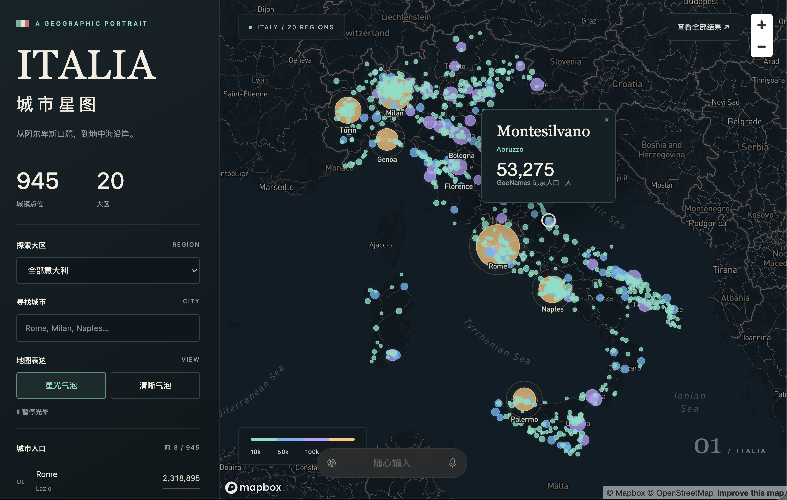
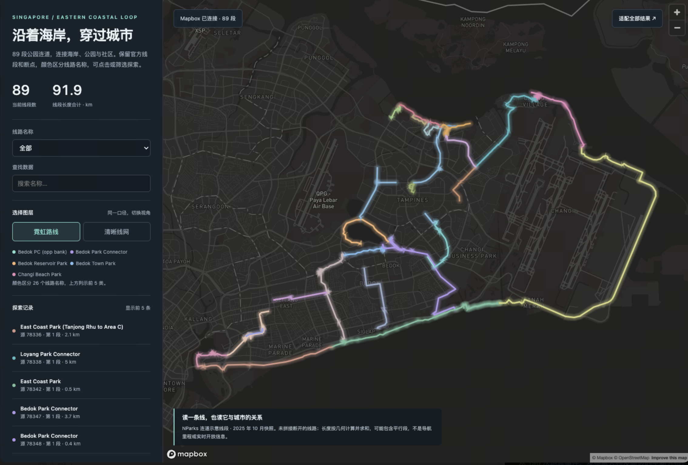
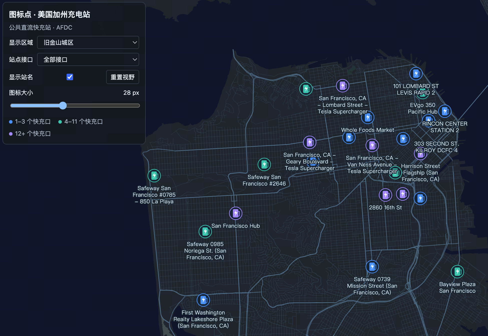
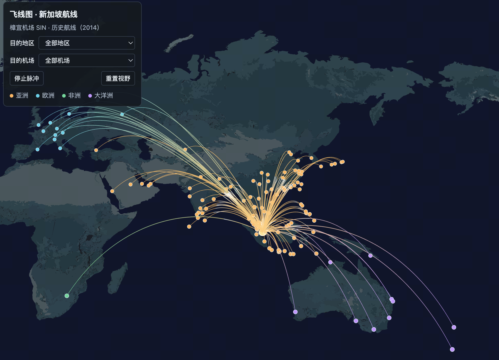
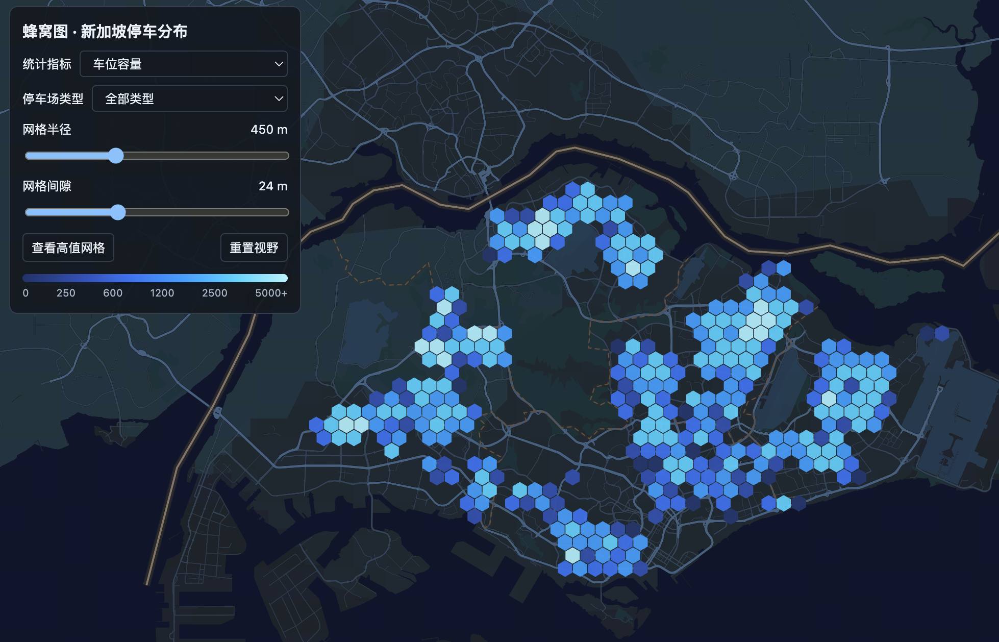
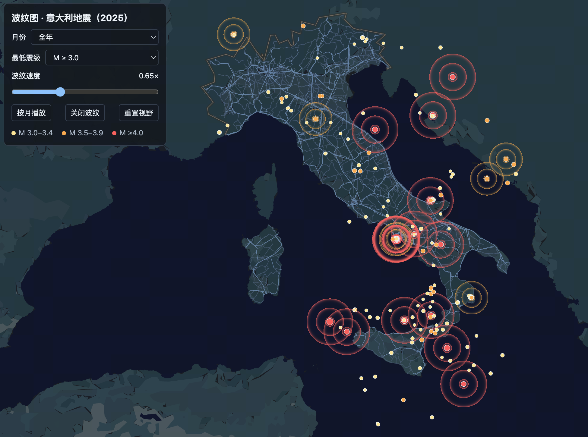
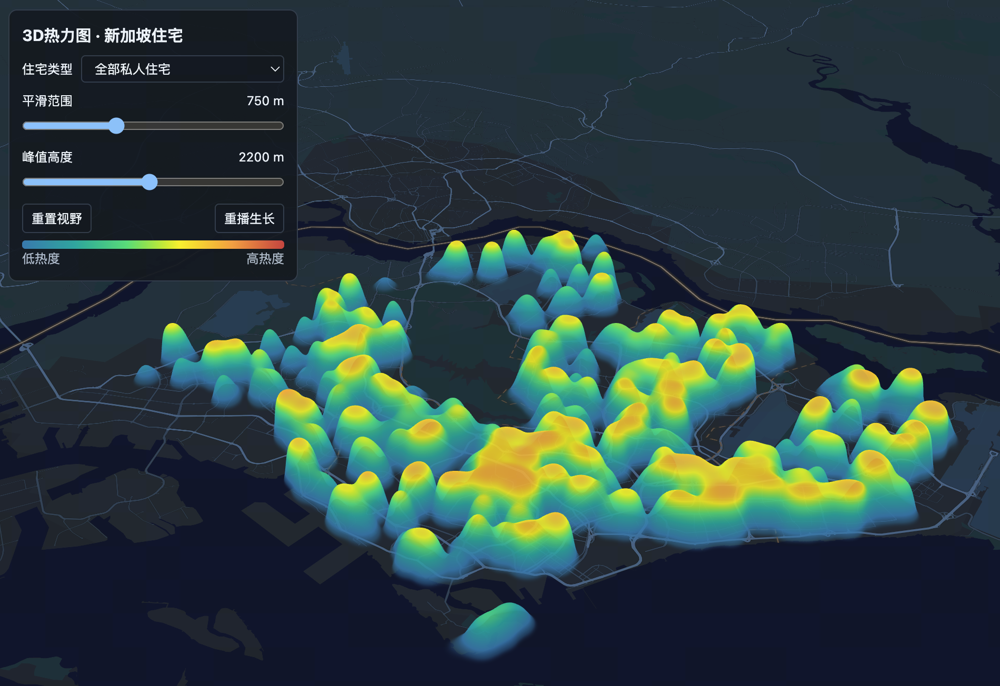
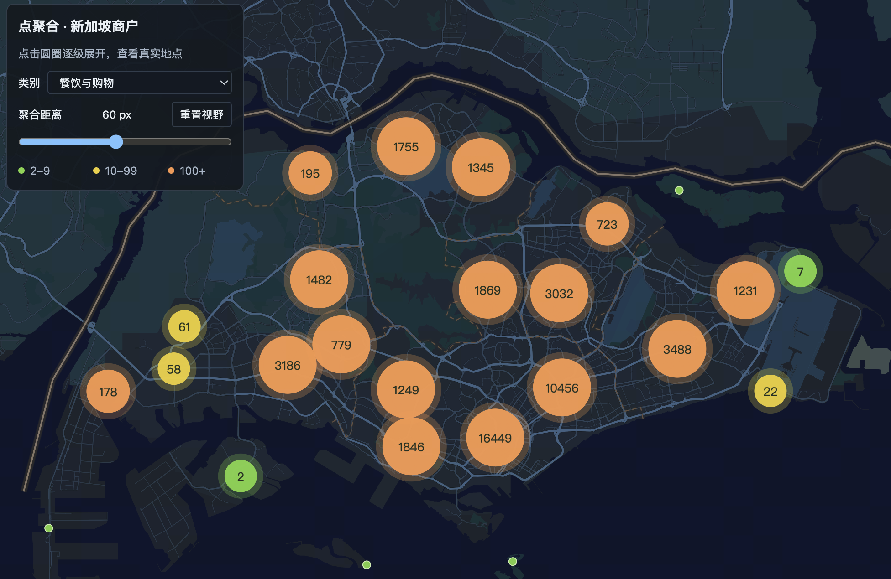

# Geo Data Viz

一个独立的地理数据可视化 Agent Skill：在 AI 对话中提供 CSV、Excel、JSON 或 GeoJSON，由 Agent 分析字段和空间数据，根据任务生成交互式地图。

支持为 Google Maps、Mapbox、Maptec、百度、高德、腾讯选择实现路线。地图需要用户自己的 Key 和相应权限；能力参考文档不代表六家所有图层均已通过真实环境验收。

## 效果展示

以下截图展示不同数据与可视化效果的组合，作品可由 Skill 按任务生成独立页面。

| | |
| --- | --- |
| **意大利城市人口 · 星光气泡**<br> | **新加坡滨海连道 · 霓虹路线**<br> |
| **加州充电站 · 图标点**<br> | **新加坡历史航线 · 飞线**<br> |
| **新加坡停车分布 · 蜂窝图**<br> | **意大利地震 · 波纹图**<br> |
| **新加坡住宅 · 3D 热力图**<br> | **新加坡商户 · 点聚合**<br> |

## 安装到 Codex

在终端执行（目标目录应不存在）：

```bash
git clone https://github.com/FloraCat526/geo-data-viz.git "${CODEX_HOME:-$HOME/.codex}/skills/geo-data-viz"
```

也可以下载仓库，将包含 `SKILL.md` 的整个目录命名为 `geo-data-viz`，放入 Agent 的技能目录。此仓库发布独立 Skill，不依赖演示平台或视频工程。

## 使用

在对话中附上数据并调用：

> 使用 $geo-data-viz 分析附件门店数据。坐标为 WGS84，用订单量生成气泡图，按区域筛选。使用我选择的地图平台和提供的 Key。

Agent 会先分析数据与坐标系，确定指标和视觉表达，再生成本次数据的地图作品。无明确坐标系的表格不会仅凭数值猜测坐标系。只有地址时需另行完成有依据的地理编码。

Python 3.10+ 可运行基础分析，无需额外依赖。Excel XLSX/XLSM 可在虚拟环境安装可选依赖：

```bash
python3 -m pip install -r requirements-excel.txt
```

直接运行分析脚本：

```bash
python3 scripts/profile_geo.py /path/to/stores.csv --out-dir work/profile \
  --crs wgs84 --lng-field longitude --lat-field latitude --value-field orders
```

## 目录

- [SKILL.md](SKILL.md)：工作流入口。
- `scripts/`：本地数据分析与规范化。
- `assets/adapters/`：地图 SDK 接入辅助模块和近似坐标转换。
- `assets/screenshots/`：README 效果展示截图。
- [references/](references/)：数据契约、效果选择和各家地图参考。
- `agents/`：Agent 界面元数据。
- `tests/`：数据分析、坐标转换和模拟 SDK 回归测试。
